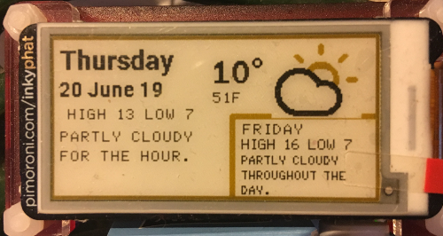

# inkyphat_weather
Python3 code to display current and near-term weather conditions on an Pimoroni Inky pHAT eInk screen Using the [Dark Sky API](https://darksky.net/dev/) and Lukas Kubis's Python wrapper [darkskylib](https://github.com/lukaskubis/darkskylib/). My installation is on a Raspberry Pi Zero W running headless on my kitchen wall. There are two versions of the code: phat_weather.py, that tells you about the weather today and tomorrow, and phat_weather_today.py that gives a lot more detail about what is going on with the weather today, including the barometric pressure, dewpoint, wind speed, gusts and Beaufort scale numbers.

## Darksky Update! Since Darksky was bought by Apple, they are not allowing new signups. I will update my code to something like Open Weather soon.

## UK units
In both sets of codes there are a lot of different units, because I live in the UK, where we talk about temperature in Celcius, but windspeed in miles-per-hour. I've also incuded the temperature in Farhenheit units as well, because that makes more sense to me! In the second example 'Bft.' refers to the Beaufort scale, and the wind description is also taken from the Beaufort Scale.

## Acknowledgements
- I took inspiration from Alan Cunningham's [Inky pHAT Dark Sky weather display](https://github.com/AlanCunningham/inkyphat-darksky-weather-display/) 
- The icons are based on Adam Whitcroft’s [Climacons](http://adamwhitcroft.com/climacons/)
  - I used Gimp to convert the Climacon images to the custom pallet that the inky pHAT requires and to make the sun icons yellow, which is a neat effect and why I bought a yellow Inky pHAT from [Pimoroni](https://shop.pimoroni.com/products/inky-phat)
- If you are new to the Inky pHAT, you should read the Pimoroni pages about it [Getting Started with Inky pHAT](https://learn.pimoroni.com/tutorial/sandyj/getting-started-with-inky-phat)

## Dependencies and requirements
- You will need to get an API key from Dark Sky and know your longitude and latitude
- [Inky pHAT library](https://github.com/pimoroni/inky)
- [darkyskylib](https://github.com/lukaskubis/darkskylib)
- [Pillow](https://pillow.readthedocs.io/en/stable/) imaging library
- Sadly Dark Sky has been bought by Apple. Free access to the API will stop working at the end of 2021. They are also not accepting new signups. I need to update my code to a new free API when I get a chance. If you don't already have a Dark Sky login, I hope you will find the rest of this code useful anyway. Read more about what happened to Dark Sky at https://blog.darksky.net/

## Tips
- On your own system you may need to adjust the loction of the resource files (the fonts and icons, depending on where you put them). I found that I needed absolute links n the code to make it work properly.
- I suggest creating a cron job that refreshes the screen every 15 minutes with new data. This is a lot simpler than it sounds, check [here](https://www.ostechnix.com/a-beginners-guide-to-cron-jobs/) for guidance. I did not see any benefit to more frequent requests.

## Example
### phat_weather.py

### phat_weather_today.py

## License

GNU General Public License v3.0
